# E-Learning Platform: Student Learning Flow

## Core User Journey Diagram

```mermaid
flowchart TD
    %% Student Learning Flow - Core Sequence
    A[Logged-In Dashboard<br/>with Active Courses] --> B
    subgraph B [Access Enrolled Course]
        B1["Select Course Card<br/>(with Progress %)"]
        B1 --> B2["Course Landing Page<br/>- Overview<br/>- Progress Summary<br/>- Next Lesson"]
    end

    B2 --> C["Course Syllabus View<br/>(Module/Lesson Tree)"]
    C --> D{Start Lesson?}
    D -->|Yes| E

    subgraph E [Lesson Flow]
        E1["Lesson Document View<br/>- Reading Content<br/>- Progress Tracker"]
        E1 --> E2["Mark as Read<br/>(Optional/Manual)"]
        E2 --> E3["Take Quiz<br/>Button"]
        E3 --> E4{Quiz Mode}

        E4 -->|Practice Mode| F1["Practice Quiz<br/>(Ungraded, Retry)"]
        E4 -->|Assessment Mode| F2["Graded Quiz<br/>(Scored, Limited Attempts)"]

        F1 --> G["Quiz Results View<br/>- Score & Correct Answers<br/>- Explanations"]
        F2 --> G

        G --> H{Passing Score?}
        H -->|Yes| I["Lesson Completion<br/>- Marked Complete<br/>- Badge Awarded<br/>- Progress Updated"]
        H -->|No| J["Retry Available?<br/>(Attempts Remaining)"]
        J -->|Yes| E3
        J -->|No| K["Review Mode<br/>Study Materials"]
    end

    I --> L["Update Learning Path<br/>- Next Lesson Unlocked<br/>- Module Progress Updated"]
    L --> M["Check Course Progress<br/>(Overall % & Status)"]
    M --> N{Achievements Unlocked?}
    N -->|Yes| O["Show Badge/Achievement<br/>- Module Complete<br/>- Streak Bonus<br/>- Course Milestone"]
    N -->|No| P["Continue Prompt<br/>(Next Lesson/Module)"]

    O --> P

    P --> Q{Continue Learning?}
    Q -->|Yes| D
    Q -->|No| R["Return to Course Page<br/>or Dashboard"]

    %% Side Panels & Persistent Features
    subgraph S [Persistent Navigation]
        S1["Course Progress Sidebar<br/>- Overall: 65%<br/>- Module 1: ✓<br/>- Module 2: ████░░ 80%<br/>- Module 3: █░░░░░ 20%"]
        S2["Quick Access Menu<br/>- Syllabus<br/>- Notes<br/>- Resources<br/>- Discussions"]
        S3["Achievement Badges<br/>- Quick Learner: 🏆<br/>- Perfect Score: ⭐<br/>- Module Master: 🎯"]
    end

    subgraph T [Review & Analytics Access]
        T1["Quiz History Review<br/>- All Attempts<br/>- Score Trends<br/>- Weak Areas"]
        T2["Learning Analytics<br/>- Time Spent<br/>- Progress Pace<br/>- Course Comparison"]
        T3["Achievement Dashboard<br/>- All Badges<br/>- Leaderboard<br/>- Streak Calendar"]
    end

    %% Connections
    E1 -.-> S1
    G -.-> T1
    O -.-> S3
    M -.-> T2
    R --> A

    %% Styling
    classDef primary fill:#e1f5fe,stroke:#01579b,stroke-width:2px
    classDef secondary fill:#f3e5f5,stroke:#4a148c
    classDef decision fill:#fff3e0,stroke:#e65100
    classDef completed fill:#e8f5e8,stroke:#1b5e20

    class A,B1,B2,C,D,E1,E2,E3,F1,F2,G,I,L,M,O,P primary
    class S1,S2,S3,T1,T2,T3 secondary
    class H,J,N,Q decision
    class I completed
```

### Key to Diagram Elements
*   **Primary Flow (Blue)**: The main path a student takes.
*   **Supporting Features (Purple)**: Persistent navigation and review panels.
*   **Decision Points (Orange)**: Key choices or checkpoints.
*   **Completion State (Green)**: Success state when a lesson is finished.
